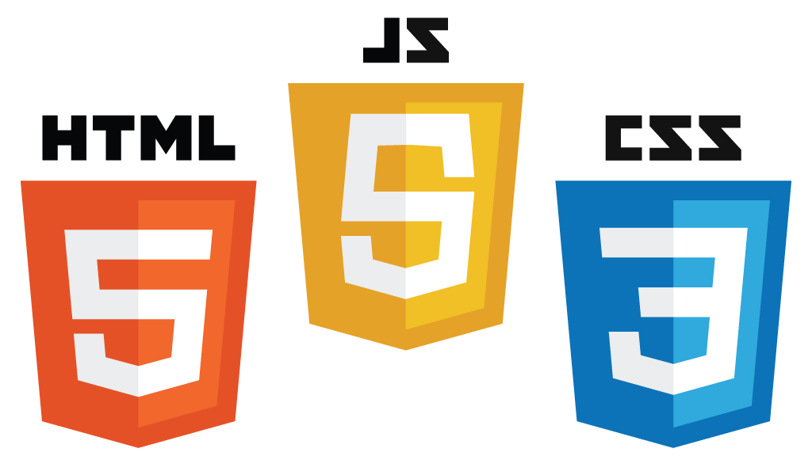
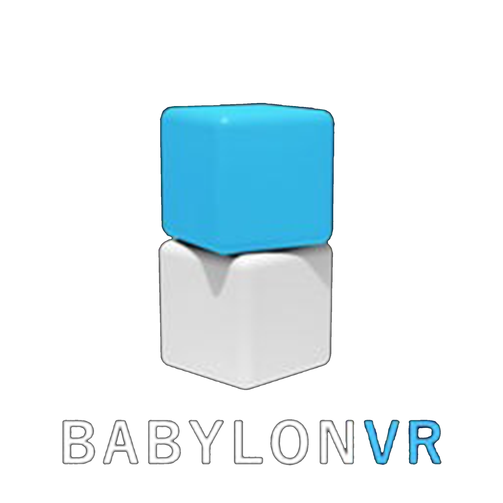

# https://royblueky.github.io/

<!DOCTYPE html>
<html>
<head>
	<meta charset = "UTF-8">
	<meta content="width=device-width, initial-scale=1, maximum-scale=1, user-scalable=no" name="viewport">
	<title>Roy Li - Personal Website</title>

	<link rel="stylesheet" href="css/style.css">

	<!-- bootstrap -->
	<link href="css/bootstrap.min.css" rel="stylesheet" type="text/css">
	<link rel='stylesheet prefetch' href='https://fonts.googleapis.com/css?family=Source+Sans+Pro:300,400,600'>

	<!-- Font Awesome -->
	<!-- <link rel="stylesheet" href="https://maxcdn.bootstrapcdn.com/font-awesome/4.3.0/css/font-awesome.min.css"> -->
	<link rel="stylesheet" href="https://maxcdn.bootstrapcdn.com/bootstrap/3.3.7/css/bootstrap.min.css">
	<link rel="stylesheet" href="https://maxcdn.bootstrapcdn.com/font-awesome/4.3.0/css/font-awesome.min.css">

	
	
	
	
	

	</head>

<body style="background:#6495ED; ">

    

        

            <!--**********Navbar Brand**********-->
			

				<a href="3" class="brand">Y.L</a>
				<button class="navbar-toggle" data-toggle="collapse" data-target=".navHeaderCollapse">
					
					
					
				</button>
			

			
			<!--Links-->
			

				<ul class="nav navbar-nav">
					<li class="nav-item active">
						<h1 align="center"><a href="#main_page" class="effect-underline">Home</a></h1>
					</li>
					<li class="nav-item active">
						<h1 align="center"><a href="#about" class="effect-underline">About</a></h1>
					</li>
					<li class="nav-item active">
						<h1 align="center"><a href="#project" class="effect-underline">Project</a></h1>
					</li>
					<li class="nav-item active">
						<h1 align="center"><a href="#experience" class="effect-underline">Experience</a></h1>
					</li>
					<li class="nav-item active">
						<h1 align="center"><a href="#education" class="effect-underline">Education</a></h1>
					</li>
					<li class="nav-item active">
						<h1 align="center"><a href="#contact" class="effect-underline">Contact</a></h1>
					</li>
				</ul>
				<ul class="nav navbar-nav navbar-right">
					<li class="nav-item active">
						<h1 align="center"><a href="#" class="effect-underline">Resume</a></h1>
					</li>
				</ul>
			

        

    

	<!--**********Home Page**********-->
	

		

			

				

					

						
 H E L L O !

						 

						
 Welcome to Roy's Personal Website!

						<a href="#about"><i id="downward1" class="fa fa-arrow-circle-down fa-4x bounce"></i></a>
					

				

			

		

	

	<!--**********About Page**********-->
	<section id="about">
		

			<h2 id="section-title">About</h2>
			

				
			
I am a 2A student from the University of Waterloo, enrolled in Computer Engineering. I am a self-taught web and software developer and quick leaner, which helps me work and study efficiently.
			

			<a href="#project"><i id="downward2" class="fa fa-arrow-circle-down fa-4x bounce"></i></a>
		

	</section>

	<!--**********Education Page**********-->
	<section id="project">
		

			<h2 id = "section-title">Projects</h2>
			

			
	
				

					

						
					

					

						
I taught myself python in December, 2016. I only spent 3 days to complete the game "tic-tac-toe" since started to learn python.
						
		
					

				

				

					

						
					

					

						
I create a stopwatch with Arduino and ESP8266 during my first co-op term.
						
		
					

				

				

					

						
					

					

						
I studied Java in grade 12 and have used eclipse for about one year.
						
		
					

				

				

					

						
					

					

						
I studied Android Studio during my 1B study term and complete a school project called "2048".
						
		
					

				

				

					

						
						
					

					

						
I started to learn HTML, CSS and Javascript during my first co-op term. I have designed and make a introduction webpage for my previous company, 
						and complete the "gomoku" game with Javascript.
						
		
					

				

			

		
	
		<a href="#experience"><i id="downward2" class="fa fa-arrow-circle-down fa-4x bounce" aria-hidden="true"></i></a>		
	</section>
	<!--**********Skills Page**********-->
	<section id="experience">
		

			

				<h2 id = "section-title">Experience</h2>
				

				

					

						
						

							
I worked for Chasr Athletics from January, 2017 to March, 2017. I worked with Arduino and code for a stopwatch used in running. 
							We tested our products with athletes from the University of Waterloo sports team and they accepted to use our it in the future.
							
		
						

					

					

						
						

							
I worked for start-up company called Babylon VR from March, 2017 to April, 2017 as a web developer. I designed and built an introduction webpage for them with HTML and CSS.
							I gained experience with email marketing as well.
							
		
						

					

					

						
						

							
I worked for Orbis Communications during my second co-op from September, 2017 to December, 2017 as a QA analyst. 
							I used Jmeter for testing and have done a lot of manual testing. I obtained experience using JSP and Eclipse too.
							
		
						

					

				

			

		

		<a href="#education"><i id="downward2" class="fa fa-arrow-circle-down fa-4x bounce" aria-hidden="true"></i></a>
	</section>

	<section id="education">
		

			

				<h2 id = "section-title">Educatoion</h2>
				

				
	
					
					

						
I studied my Grade 10 and Grade 11 in Handan No.1 High School, which is one of the TOP 100 high schools in China.
						I was always ranked in top 200 among more than 2000 students.
						

					

				

				

				
					

						
I finished my Grade 12 in Canada International College in Toronto. I was the president of the student council.
						I helped my school to hold Festival parties and the graduation ceremony as a Chief planner.
						

					

				

				

				
					

						
I am studying my 2A term in the University of Waterloo in Computer Engineering.
						

					

				

			

		

	</section>
	<section id="contact" style="padding-top: 50px;">
		<footer class="footer_1">
			

				<ul class="social-media_1">
					<li class="item_4">
						
					</li>
					<li class="item_4">
						
					</li>
					<li class="item_4">
						
					</li>
				</ul>
				
© 2018 Yifan Li.</i> All rights reserved.

			

		</footer>
	</section>
</body>
</html>
